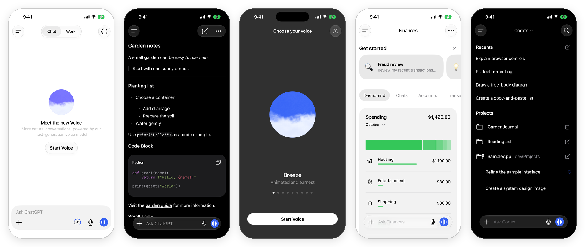

# ChatGPT iOS UI

A SwiftUI recreation of the ChatGPT iPhone app's interface — every screen in light and dark, Liquid Glass included — with no backend attached. Drop it into your app and plug in your own model.

[](https://github.com/bryanrg22/chatgpt-ios-ui/actions/workflows/ci.yml)


[](LICENSE)

<p align="center">
  
</p>

> [!NOTE]
> **Unofficial.** This project is not affiliated with, endorsed by, or sponsored by OpenAI. ChatGPT is a trademark of OpenAI. The recreation follows ChatGPT for iOS version 1.2026.267, observed in October 2026.

## What's inside

- **`ChatGPTUI`** — SwiftUI views and presentation state for the app: chat and composer, sidebar, voice, camera, photos and video, rich Markdown with code and tables, settings, Codex, Your dot calls, Health, Finances, Space, Images, Work tasks, Sites, Projects, Plugins, Memory, Search and Scheduled.
- **`ChatGPTWidgets`** — Home Screen widget views with deep links.
- **A demo app** in [`Examples/ChatGPTUIDemo`](Examples/ChatGPTUIDemo) with fictional data, a real WidgetKit extension, and a `--screen <name>` shortcut that opens any of the 40 catalogued screens directly.
- **Four test suites** — unit, screenshot, UI and accessibility — running in CI. See [TESTING.md](TESTING.md).

The package draws the interface and keeps presentation state only. It makes no network calls, needs no API keys, and never touches the microphone, camera or photo library: your app supplies all of that.

## Requirements

- Xcode 26.4 or newer (the screenshot references are recorded with Xcode 27.0)
- iOS 26 or newer
- Swift 6.2

## Try the demo

1. Clone the repository.
2. Open `Examples/ChatGPTUIDemo/ChatGPTUIDemo.xcodeproj`.
3. Choose the `ChatGPTUIDemo` scheme and an iPhone simulator, then press Run.

Sending a message streams a canned local reply. To jump to a screen, add a launch argument in the scheme, for example `--screen codex` or `--screen settingsAbout --light`. Every name is listed in [`Shared/DemoScreen.swift`](Examples/ChatGPTUIDemo/Shared/DemoScreen.swift).

## Use it in your app

Add the package in Xcode (**File → Add Package Dependencies…**) with this repository's URL, or in `Package.swift`:

```swift
.package(url: "https://github.com/bryanrg22/chatgpt-ios-ui", branch: "main")
```

Then own a `ChatState`, show `ChatGPTView`, and answer the actions it sends you. This example streams a reply from your own backend:

```swift
import ChatGPTUI
import SwiftUI

struct ContentView: View {
    @State private var chat = ChatState()
    @State private var reply: Task<Void, Never>?

    var body: some View {
        ChatGPTView(state: chat)
            .onAppear { chat.onAction = handle }
    }

    private func handle(_ action: ChatAction) {
        switch action {
        case .send(let text, _, _, _, _):
            guard let id = chat.responseID else { return }  // set by the UI just before .send
            reply = Task {
                var answer = ""
                do {
                    for try await chunk in MyBackend.stream(prompt: text) {  // your API client
                        answer += chunk
                        chat.updateResponse(id: id, text: answer)  // full text so far
                    }
                } catch {
                    answer += "\n\n(Something went wrong.)"
                }
                chat.updateResponse(id: id, text: answer, finished: true)
            }
        case .stop:
            reply?.cancel()
        default:
            break
        }
    }
}
```

## How it works

Data flows in one direction, and the package never decides what happens next:

```text
your app ──data──▶ ChatState ──▶ ChatGPTView ──user taps──▶ ChatAction ──▶ your handler ──▶ your backend
    ▲                                                                                         │
    └──────────────────────── updateResponse, messages, feature data ◀─────────────────────────┘
```

- **State in.** `ChatState` and its feature states (`chat.voice`, `chat.codex`, `chat.finance`, …) hold what the screens show. Set them from your data.
- **Actions out.** Every button that would need a server, a device or the system emits a typed action instead: send, stop, retry, attach, connect a provider, open a link.
- **Stale replies are ignored.** Each response has an ID. Updates for a stopped or replaced response are dropped, so a slow network can't overwrite a newer answer.

The [integration guide](docs/INTEGRATION.md) covers every feature area: voice, camera, media, Markdown, Codex, Your dot, Health, Finances, Space, Images, Settings and widgets.

## What's covered

| Area | Status |
|---|---|
| Chat, composer, conversation actions, sidebar | ✅ Built |
| Voice chooser, session, settings, sharing, live camera | ✅ Built (silent; no audio) |
| Camera, photo picker, image and video viewer | ✅ Built (your app supplies the media) |
| Markdown, code blocks, tables, inline code | ✅ Built |
| Codex, Your dot, Work tasks, Images, Sites, Projects, Space, Plugins, Memory, Search, Scheduled | ✅ Built, with some sub-pages still placeholders |
| Health and Finances | ✅ Built; disconnected and error states not yet captured |
| Settings: General, Personalization, About | ✅ Built; several deeper pages are placeholders |
| Home Screen widgets | ✅ Built as a real WidgetKit extension |
| Lock Screen, Live Activities, Dynamic Island, system call UI | ⬜ Not yet |

Placeholders show a clear "not built yet" notice instead of pretending to work. The full record of what was captured from the real app, and how closely each screen matches it, is in [docs/fidelity](docs/fidelity/ROUTE_COVERAGE.md).

## Project layout

```text
Sources/ChatGPTUI/          The interface: views and presentation state
Sources/ChatGPTWidgets/     Widget views and deep links
Tests/ChatGPTUITests/       Unit tests (run on the Mac with `swift test`)
Examples/ChatGPTUIDemo/     Demo app, widget extension, screenshot and UI tests
docs/                       Integration guide, feature guides, fidelity records
```

## Contributing

Contributions are welcome — especially updates when the real app changes. Every visual change needs before-and-after evidence: a screenshot or recording of the real app next to the same screen in the recreation, captured on the same device size and appearance, with personal information removed. See [CONTRIBUTING.md](CONTRIBUTING.md) for the full process and [TESTING.md](TESTING.md) for updating screenshot references.

## License

The source code is available under the [MIT License](LICENSE). Bundled fonts, artwork and dependencies keep their own terms; see [ASSETS.md](ASSETS.md) and [Swift-Markdown-LICENSE.txt](Swift-Markdown-LICENSE.txt).
